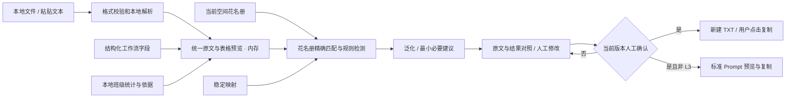

# 架构与隐私数据流

本文件记录工程决定，不替代根目录六份需求基线。当前范围为 Phase 0–10 的 V1 核心实现及 Phase 11 已完成检查。

## 分层

| 层           | 实现                                 | 职责与边界                                                                                                         |
| ------------ | ------------------------------------ | ------------------------------------------------------------------------------------------------------------------ |
| 文档适配     | `src/adapters/document.ts`           | 校验类型与大小，按格式动态加载本地解析器；输出统一文本、表格预览、提取限制。与脱敏规则无耦合                       |
| 身份与持久层 | `src/storage/`                       | 学号建立身份；名字不作为唯一键。IndexedDB 单读写事务合并名单、分配单调递增代号；独立内存实现支持会话与演示         |
| 识别层       | `src/engine/detectors.ts`            | 可注册 detector；花名册精确规则、标注字段、形态规则、泛化词表和自定义字面规则分别处理                              |
| 脱敏核心     | `src/engine/engine.ts`               | 接受纯文本上下文，返回源文本坐标与识别原因；按优先级接受候选并用有序区间消除重叠，再一次渲染，避免替换串递归处理  |
| 复核状态     | `src/engine/review.ts`               | 保存原文与标记；每次修改递增版本并取消确认；剩余信息重新扫描；同名待确认项阻止确认                                 |
| 输出与工作流 | `src/workflow/prompt.ts`、ReviewPane | `approvedText()` 校验当前版本已复核；TXT 从脱敏文本新建；Prompt 不读取花名册、映射或文件元数据；L3 拒绝生成 Prompt |
| UI           | `src/components/`、App               | 六入口统一进入处理链。状态、错误、风险、手工确认都显式呈现                                                         |
| 工作流       | `src/workflow/`                      | 统一模板 schema、字段校验、材料序列化和 Prompt 生成；结构化字段整体进入复核，不存在字段旁路                        |
| 本地分析     | `src/analytics/`                     | 纯函数计算成绩、考勤、请假、连续变化与实训 / 实习异常；每条观察同时产生事实依据，不做学生定性                      |
| AI 出口      | `AIExitPane`                         | 只保存官网名称和 HTTPS 地址；去除查询参数、片段和凭据；仅由用户点击后打开空白官网                                  |
| HTML 汇报    | `src/presentation/`                  | 独立 16:9、15 页状态；键盘、全屏、页码、进度、讲者备注及第 12 页 Demo 往返                                         |

## 数据流

没有模型调用、文件上传、后端、账户、遥测、远程字体或运行时 CDN。`File.arrayBuffer()` 的“上传”控件实为本地读取。PDF 支持资源与 worker 都随构建打包。应用代码没有 `fetch`、XHR、WebSocket、sendBeacon 或表单提交调用；Service Worker 只预缓存应用静态资源。CSP 进一步限制脚本、连接与嵌入，禁止表单提交和第三方框架。AI 官网入口只在用户点击时执行顶层导航，保存前移除查询参数、片段及网址凭据。开发服务器自身的 HMR 连接不是业务数据流，正式产物没有 HMR。

## 工作流与本地分析边界

- 21 个工作流模板共享 `WorkflowTemplate` schema：`id`、`title`、`category`、`privacyLevel`、`requiresRedaction`、`fields`、`promptTemplate`、`outputFormat`、`guardrails`。
- 当前所有模板都要求脱敏，因为通知、班会等表单仍可能被填入学生姓名。字段和值先序列化为一个文本材料，再进入与文档相同的检测、复核和版本确认；Prompt 生成函数再次调用 `approvedText()`。
- 默认约束禁止补造事实、心理诊断、学生标签和风险定性；不同模板再追加招聘、简历、评优或心理健康班会的专门约束。
- 本地分析只接受 CSV/XLSX 文本表格。用户映射字段后，纯函数计算成绩均值、达到 60 分的比例、次数汇总和变化。60 分是显示阈值，不声称等于课程通过规则；界面明确要求核实。
- “值得关注”由透明规则产生，显示阈值和原始数值依据。老师选择记录后才生成摘要；摘要仍含身份标识，必须通过完整脱敏复核才可生成班级分析 Prompt。
- 工作流草稿、分析表、筛选和结果只在页面内存；切页卸载。AI 官网设置是唯一写入 localStorage 的数据，只包含名称和已清理网址，不含 Prompt 或学生材料。

## 身份及映射决定

- 本机默认单一学校/数据空间，以文本学号为身份键，支持多个班级。要求花名册包含姓名与学号；没有学号的材料仍可通过规则和手工标记处理，但不会假装建立可靠身份。
- 相同学号、不同姓名拒绝导入；相同姓名、不同学号保存为不同学生。已有学号更新其他字段时保留代号。
- 同名只有在同一行/句存在唯一学号或电话证据时消歧。证据不唯一时不猜测，输出“同名学生·待确认”。复核者可修改为核对后的代号或采用不区分身份的标记。
- 名单导入时分配代号，跨文件、刷新、重排导入继续复用。清除映射不重用旧代号，避免旧文件中的 S001 被新身份复用；仅保存无身份关系的递增计数。
- IndexedDB 更新是一个事务，多个窗口并发不会覆盖或分配重复代号。持久模式清除/导入通过 BroadcastChannel 通知其他窗口刷新，丢弃过时原文、复核结果和 Prompt。
- 映射只保存在当前空间，UI 只在识别结果中呈现相应代号；无映射导出功能。

## 保留和清除

| 数据                             | 持久模式      | 会话模式      | 演示模式               |
| -------------------------------- | ------------- | ------------- | ---------------------- |
| 花名册和映射                     | IndexedDB     | 独立内存      | 固定虚构数据，独立内存 |
| 原文件、原文、表格、复核、Prompt | 页面内存      | 页面内存      | 页面内存               |
| 自定义字面规则                   | 页面内存      | 页面内存      | 页面内存               |
| 历史任务                         | 当前不保存    | 不保存        | 不保存                 |
| 应用资源                         | Cache Storage | Cache Storage | Cache Storage          |

模式在应用初始化前确定。演示/会话从不打开学生 IndexedDB；进入演示还禁用文件和花名册导入。切换/刷新销毁原页面内存；演示刷新重新生成虚构数据。会话空间与持久空间互不复制：切入会话不代表删除以前的持久资料，界面对此明确说明。清除资料同时丢弃当前原文、复核与 Prompt。浏览器清理不能撤回用户已下载的文件或已复制的系统剪贴板，也不宣称磁盘取证级擦除。

## 复核契约

1. 源文本、任务、泛化开关、等级、花名册或规则改变，原复核作废。
2. 标记的恢复、删除、替换或手工新增，使复核版本递增；撤销风险确认。
3. 输出文本重新运行检测，展示剩余规则命中，包括被恢复或重新输入的直接标识符。
4. 用户须确认已检查剩余信息和组合风险；同名歧义项须逐项处理。高风险恢复允许用户明确负责地保留，系统不把它标为低风险。
5. UI 按钮和核心输出函数双重检验版本，不能通过另一路 Prompt 生成跳过确认。此闸门约束正常应用流程，不声称防止设备持有者用开发者工具改写自己的程序。

## 文档与资源边界

- TXT 支持 UTF-8、带 BOM 的 UTF-16；其他编码明确报错。CSV 按文本读取，保留前导零。
- XLSX 保留表格文本与表名并纳入复核；不执行公式、不呈现 HTML。只导出新 TXT，避免原文件隐藏对象泄漏。
- DOCX 只使用 Mammoth 的 `extractRawText`，不将其 HTML 插入 DOM。提示页眉页脚、文本框、批注等不保证提取。
- PDF 使用修复安全公告的 PDF.js 6.2.108，不渲染链接、表单、脚本或附件。全无文字时报可检索文本提示；部分空白页警告遗漏。
- 文件 10 MB、规范化文本 30 万字符、PDF 200 页、工作簿 50 张表、表格 20 万单元格、ZIP 声明展开 50 MB / 5000 条目上限。
- 上限不是完整恶意文档沙箱：解析目前在主线程（PDF 内部 worker 除外），仍可能遇到复杂压缩文件与大花名册阻塞。脱敏重叠消解已改为 O(n log n)，并以接近上限、含 17,500 个命中的虚构文本建立性能回归；后续仍应将文档适配器整体放进可终止 Worker，并增加实际解压预算。
- PDF.js 字符映射、标准字体和 WASM 由 `scripts/prepare-pdf-assets.mjs` 在开发/构建前按版本和文件清单校验后完整替换。Vite 配置加载不再复制文件，避免中断后留下重复或不完整资源并拖慢构建。
- 生产 PWA 缓存所有动态解析器、PDF `.mjs` worker、字符映射与字体，不仅缓存首次使用过的格式。首次完整缓存完成后才具备完整离线能力；开发模式不注册 Service Worker。

## 与需求轻微冲突的处理

- 不采用托管建站、发布或数据库工具；这是本地处理应用，严格优先 AGENTS.md。
- TASKS.md 将离线列为 Phase 9，但 Phase 0 验收和用户本轮要求离线，因此提前实现基本 PWA 支撑；不把 Phase 9 全部平台验收标为完成。
- PRD 希望尽可能导出结构化副本，但源文件隐藏内容可能绕过文本脱敏。本轮明确仅新建 TXT，结构化安全重建后续另做，不冒充已支持。
- 建议 Web Crypto 并不等于已要求本地加密。V1.1 才做加密保险箱；本轮使用 `crypto.randomUUID()` 生成手工标记标识，不以哈希冒充加密。
- 清除后重新处理需要生成新映射；保留匿名递增计数，避免代号复用。无旧关系可从当前 UI 找回。
